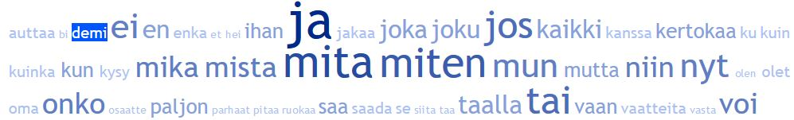

# Finnish Word Embeddings



This repository aims to collect [word embeddings](https://en.wikipedia.org/wiki/Word_embedding) for [Finnish language](https://en.wikipedia.org/wiki/Finnish_language) in one place, including embeddings trained by the author, and also links to Finnish word embeddings available elsewhere.

## List of available embeddings
|   Source																|   Model		|   Dimension	|  	Trained on								|	Download link 	|
|---																	|---			|---			|---										|---			  	|
|   [Facebook](https://fasttext.cc/docs/en/crawl-vectors.html)			|   FastText	|	300			| 	Wikipedia and CommonCrawl				|		[Binary](https://dl.fbaipublicfiles.com/fasttext/vectors-crawl/cc.fi.300.bin.gz) / [Text](https://dl.fbaipublicfiles.com/fasttext/vectors-crawl/cc.fi.300.vec.gz) |
|   [Facebook](https://fasttext.cc/docs/en/pretrained-vectors.html)		|   FastText	|	300			| 	Wikipedia								|		[Binary + Text](https://dl.fbaipublicfiles.com/fasttext/vectors-wiki/wiki.fi.zip) / [Text](https://dl.fbaipublicfiles.com/fasttext/vectors-wiki/wiki.fi.vec)	|
|   [Turku NLP](https://turkunlp.org/finnish_nlp.html)					|  	Word2Vec	|	Unknown 	|   Finnish Internet Parsebank          	|	[Binary](http://dl.turkunlp.org/finnish-embeddings/finnish_4B_parsebank_skgram.bin)				|
|   [Turku NLP](https://turkunlp.org/finnish_nlp.html)					|  	Word2Vec	|	Unknown 	|   Suomi24									|	[Binary](http://dl.turkunlp.org/finnish-embeddings/finnish_s24_skgram.bin)				|
|   [Turku NLP](https://turkunlp.org/finnish_nlp.html)					|  	Word2Vec	|	Unknown 	|   Suomi24 with lemmatization				|	[Binary](http://dl.turkunlp.org/finnish-embeddings/finnish_s24_skgram_lemmas.bin)				|
|   This repository														|   Word2Vec / FastText			|   100 / 300			|   Crawled from popular Finnish websites ([details](crawling/spiders/all_spiders.py))	|	[Binary files from Kaggle datasets](https://www.kaggle.com/jmyrberg/finnish-word-embeddings) (only viable free option for now, let me know if you are willing to host these:)	|

## Example usage of word embeddings

```python
# Word embeddings in word2vec-format can easily be loaded with gensim
# See https://radimrehurek.com/gensim/models/keyedvectors.html for reference
from gensim.models.keyedvectors import KeyedVectors

# Load vectors into memory (bin in filename means binary=True)
embeddings_path = 'fasttext.fi.all.1045M.100d.bin.gz'
kv = KeyedVectors.load_word2vec_format(embeddings_path, binary=True)

# Find most similar word to 'koira'
print(kv.most_similar('koira'))
```

## Training your own word embeddings

This repository also contains the code used for crawling data from popular Finnish web sites, extracting sentences from those, and training word embeddings. The spiders used for web scraping can be found from the [*crawling*-folder](crawling/), whereas preprocessing and training of embeddings can be found from the [*embeddings*-folder](embeddings/).

Three steps are required:

1. Clone this repository using ```git clone https://github.com/jmyrberg/finnish-word-embeddings``` and install required packages with ```pip install -r requirements.txt```.

2. Crawl data by starting a spider by running [*run_spider.bat*](scripts/run_spider.bat) and typing in the name of the spider, such as *iltalehti*. All available spider names can be found from the spider class definitions in [*all_spiders.py*](crawling/spiders/all_spiders.py). See [Scrapy](https://scrapy.org/) for more information on how to create your own spiders. Optionally, you may also use your own source documents for training.

3. Preprocess crawled material and train word embeddings by running [*update.py*](embeddings/update.py). Or optionally, prepare your own documents into sentence lines and train them by running [*train.py*](embeddings/train.py).

If you follow the steps above without modifying any code, you should be able to reproduce the custom word embeddings provided in this repository. The provided code should also automatically create the folder structure under *./data/\** as follows:

* *crawl*: State of the spider to avoid duplicate scrapes
* *feed*: Crawled material with JSON line files named like *<spiderName>.jl*
* *processed*: Preprocessed crawled material in sentence line files like *all.sl*
* *embeddings*: Trained word embeddings named like *<modelName>.fi.<sentenceLineFilename>.<numberOfTokensTrainedOn>.<embeddingsDimension>.<format>.gz*

## Contributing

If you want to add, modify or remove something in the list of word embeddings or code, please feel free to make a pull request or contact me.

---
Jesse Myrberg (jesse.myrberg@gmail.com)